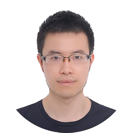

```{r, include=FALSE}
knitr::opts_chunk$set(
  results='asis', 
  echo = FALSE
)

library(glue)
library(tidyverse)

# ======================================================================
# These variables determine how the the data is loaded and how the exports are
# done.

# Is data stored in google sheets? If no data will be gather from the csvs/
# folder in project
using_googlesheets <- F

# Just the copied URL from the sheet
#positions_sheet_loc <- "https://docs.google.com/spreadsheets/d/14MQICF2F8-vf8CKPF1m4lyGKO6_thG-4aSwat1e2TWc"

# Is this sheet available for anyone to read? If you're using a private sheet
# set this to false and go to gather_data.R and run the data loading manually
# once to cache authentication
sheet_is_publicly_readable <- FALSE

# Is the goal of this knit to build a document that is exported to PDF? If so
# set this to true to have links turned into footnotes at the end of the
# document
PDF_EXPORT <- FALSE


CV_PDF_LOC <- "https://github.com/biozhangjn/CV/blob/main/Jiannan Zhang’s CV.pdf"
CV_HTML_LOC <- "www.zhangjn.xyz/cv/"


# A global (gasp) variable that holds all the links that were inserted for
# placement at the end
links <- c()

# ======================================================================
# Now we source two external scripts. One contains functions for building the
# text output and the other loads up our data from either googlesheets or csvs

# Functions for building sections from CSV data
source('parsing_functions.R') 

# Load data for CV/Resume
source('gather_data.R')
```


```{r}
# When in export mode the little dots are unaligned, so fix that. 
if(PDF_EXPORT){
  cat("
  <style>
  :root{
    --decorator-outer-offset-left: -6.5px;
  }
  </style>")
}
```


Aside
================================================================================


{width=100%}

```{r}
# When in export mode the little dots are unaligned, so fix that. 
if(PDF_EXPORT){
  glue("View this CV online with links at _{CV_HTML_LOC}_")
} else {
  glue("[<i class='fas fa-download'></i> Download a PDF of this CV]({CV_PDF_LOC})")
}
```

Contact {#contact}
--------------------------------------------------------------------------------

```{r}
contact_info %>% 
  glue_data("- <i class='fa fa-{icon}'></i> {contact}")
```
For more information, please contact me via email.

Skills {#skills}
--------------------------------------------------------------------------------
Wet-lab

- Functional analysis
- IHC/ISH/FISH/Co-IP/Chip-Seq...
- Gene-editing with CRISPR/Cas9
- PGCs culture and Microinjection

Dry-lab

- RNA-Seq data analysis
- Single-cell data analysis
- Highly skilled in R and Bash.

Disclaimer {#disclaimer}
--------------------------------------------------------------------------------

Made with the R package [**pagedown**](https://github.com/rstudio/pagedown). 

Last updated on `r Sys.Date()`.


Main
================================================================================

Jiannan Zhang {#title}
--------------------------------------------------------------------------------

```{r, results='asis'}
intro_text <- glue("Assistant Research Fellow at Sichuan University. I am also employed as a Post-doctoral Fellow in [Wang yajun](http://life.scu.edu.cn/info/1048/1836.htm) Lab at Sichuan University.")

cat(sanitize_links(intro_text))
```

I am broadly interested in Avian Physiology, Endocrinology and Metabolism, and Transgenesis in chicken.


Research Experience {data-icon=laptop}
--------------------------------------------------------------------------------

```{r}
print_section(position_data, 'research_positions')
```


Education {data-icon=graduation-cap data-concise=true}
--------------------------------------------------------------------------------

```{r}
print_section(position_data, 'education')
```


Teaching Experience {data-icon=chalkboard-teacher}
--------------------------------------------------------------------------------


```{r}
print_section(position_data, 'teaching_positions')
```


Grants {data-icon=chart-line}
--------------------------------------------------------------------------------

```{r}
print_section(position_data, 'grant')
```


Publications  {data-icon=book}
--------------------------------------------------------------------------------

```{r}
print_section(position_data, 'academic_articles')
```


Conference presentations  {data-icon=group}
--------------------------------------------------------------------------------


```{r}
print_section(position_data, 'presentation')
```


```{r}
if(PDF_EXPORT){
  cat("
  
Links {data-icon=link}
--------------------------------------------------------------------------------

<br>


")
  
  walk2(links, 1:length(links), function(link, index){
    print(glue('{index}. {link}'))
  })
}
```


